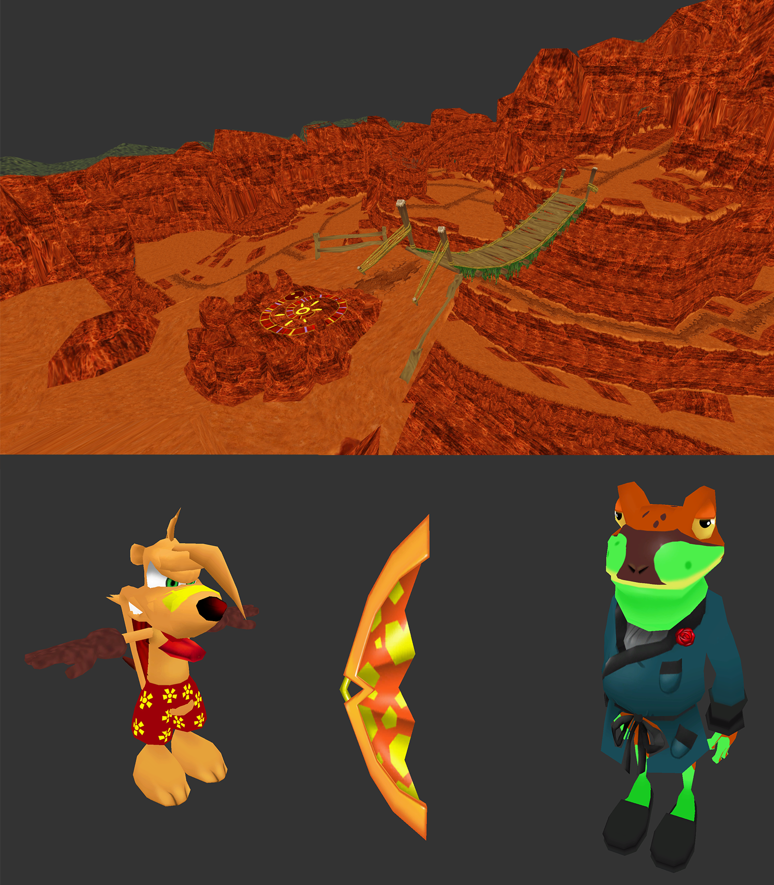

# TYViewer
A model viewer for Ty the Tasmanian Tiger.

# Controls
**WASD** to move camera\
**MIDDLE MOUSE** to rotate camera\
**LShift** speed up movement\
**LCTRL** slow down movement

**ALPHA 1** toggle grid\
**ALPHA 2** toggle bounds\
**ALPHA 3** toggle colliders\
**ALPHA 4** toggle bones

# Using
Drag '.rkv' file onto executable. A config file will be generated where program is located where you can enter which model to load. For a list of models, click [here](https://gist.github.com/Pixeln/14d7936cd92c13af976cc48d48741d39).

# Requirements (for using)
* OpenGL 3.3 compatible GPU

# Requirements (for building source)
* [GLAD](https://glad.dav1d.de/)
* [GLFW](https://www.glfw.org/)
* [GLM](https://glm.g-truc.net/0.9.9/index.html)
* [SOIL 2](https://bitbucket.org/SpartanJ/soil2)

# TODO
There is still a lot of stuff that I need to do.
* Implement materials.
* Implement animations.
* Allow for manipulating meshes.
* Allow loading in multiple models.
* Allow loading in levels with props.
* Support for Ty the Tasmanian Tiger 2 models.
* Documentation about **.mdl**, **global.mad**, and **global.model** files.
